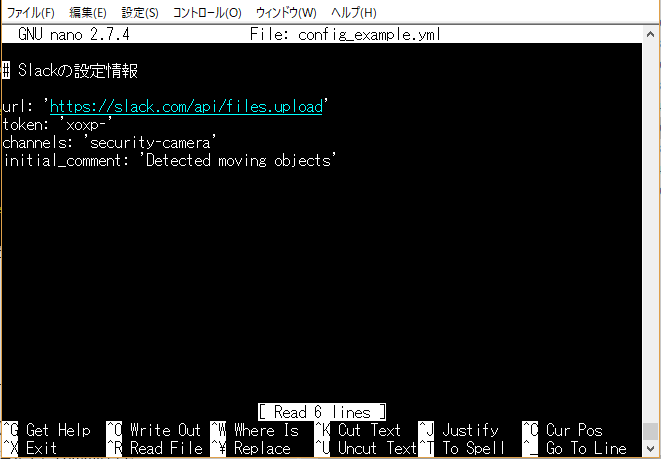
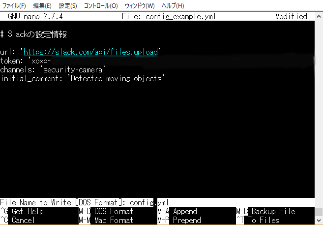

# Vol.001 焦電センサー


## 準備するもの


### 必須

* [Vol.000 でセットアップした Raspberry Pi](../vol000-raspberrypi-setup/README.md)
* [焦電センサ（SB412A）](http://akizukidenshi.com/catalog/g/gM-09002)
* [PiCamera](https://www.amazon.co.jp/dp/B01D1D0DJ0)
* LED
* 抵抗
  * [100Ω x 1個](http://akizukidenshi.com/catalog/g/gR-25101)
  * [150Ω x 1個](http://akizukidenshi.com/catalog/g/gR-25151)
  * [10kΩ x 1個](http://akizukidenshi.com/catalog/g/gR-25103)
* NPN型トランジスタ [2SC1815](http://akizukidenshi.com/catalog/g/gI-04268)
* ジャンパワイヤ
  * [オスーメス 適量](http://akizukidenshi.com/catalog/g/gC-08932)
  * [オスーオス 適量](http://akizukidenshi.com/catalog/g/gC-05371)


#### PC環境

### 任意

* モバイルバッテリ（離れた場所に Raspberry Piを置く場合）


## 体験会

キーボード、マウス、ディスプレイを Raspberry Piに接続せず、開発していきましょう！


### 今回やること

**簡易的な監視カメラ** の作成。

**焦電センサで動体を検知したら、Slackに通知を送信するシステム** を組んで、簡易的な監視カメラを作成します。

* 練習1「電子工作とPCを準備します」

* 練習2「Raspberry Piで焦電センサの出力を取得します」

* 練習3「動体を検知したら Slackに通知を送りましょう」


### 練習1「電子工作とPCを準備します」

#### 手順

1. 配布物の確認
2. Raspberry Piの準備
3. Raspberry Piに PCから ssh接続
4. PiCameraの有効化

#### 手順1「配布物の確認」

まずは、配布物がお手元に揃っているか確認します。


詳細を表にまとめました。

| 名称 | 数量 |
|:----|:----|
| [Raspberry Pi3 ModelB](./docs/exercise1/distro/raspi3b.jpg) | 1台 |
| [PiCamera](./docs/exercise1/distro/PiCamera.jpg) | 1台 |
| [USB電源](./docs/exercise1/distro/usb-power-supply.jpg) | 1本 |
| [microSDカード](./docs/exercise1/distro/micro-sd.jpg) | 1枚 |
| [ブレッドボード](./docs/exercise1/distro/breadboard.jpg) | 1枚 |
| [焦電センサ](./docs/exercise1/distro/pyro-sensor.jpg) | 1台 |
| [ピンセット](./docs/exercise1/distro/tweezers.jpg) | 1本 |
| [NPN型トランジスタ](./docs/exercise1/distro/npn-tr.jpg) | 1本 |
| [LED](./docs/exercise1/distro/led.jpg) | 1台 |
| [抵抗](./docs/exercise1/distro/resister.jpg) | 3本 |
| [長いジャンパワイヤ](./docs/exercise1/distro/long-wire.jpg) | 3本 |
| [短いジャンパワイヤ](./docs/exercise1/distro/short-wire.jpg) | 10本 |

＊ お手元に足りない部品がございましたら、スタッフまでお声がけください。


#### 手順2「Raspberry Piの準備」

次に、Raspberry Piを起動するための準備をします。

##### microSDカードの挿入

microSDカードを Raspberry Piに挿入します。


##### PiCameraの装着

PiCameraを Raspberry Piに装着します。

PiCameraは Raspberry Pi 3で写真を撮影するために必要なモジュールです。

向きがありますので、写真を見ながら挿入してください (不明な点は、スタッフまで)。


#### Raspberry Piの起動

それでは、Raspberry Piに電源を入れましょう。

電源を入れると、PCから SSH接続できるようになったり、ブレッドボードに電流が流れ、焦電センサの検知が始まったりします。


#### 手順3「Raspberry Piに PCから SSH接続」

Windowsをお使いの方は[こちら](#Windowsをお使いの方)、MACをお使いの方は[こちら](#MACをお使いの方) をご覧ください。

##### **Windowsをお使いの方**

TeraTermを起動させてください。

接続先の Raspberry Piの IPアドレスを入力します。

お手元の Raspberry Piに記載されている IPアドレスをメモします。

```
IoT School 001
10.16.128.xxx /16
```

こちらの `10.16.128.xxx` を TeraTermの『ホスト』の欄に入力します。


ポップアップが現れたら、『接続』をクリックします。

接続に成功すれば、


このような画面が現れますので、

```
　ユーザー名: pi
パスフレーズ: raspberry
```

と入力します。


Raspberry Piのコンソール画面にログインできれば成功です。

##### **MACをお使いの方**

ターミナルを開いてください。

お手元の Raspberry Piに記載されている IPアドレスをメモします。

```
IoT School 001
10.16.128.xxx /16
```

こちらの `10.16.128.xxx` を使って、

```
$ ssh pi@10.16.128.xxx
```

と、ターミナルでコマンドを実行します。

パスワードの入力を求められますので、

```
pi@10.16.128.xxx's password: raspberry
```

と入力します。


このように、Raspberry Piにログインできれば成功です。

#### GitHubからソースコードをダウンロード

SSH接続した Raspberry Piのコンソール画面で、

```
$ git clone https://github.com/cami/IoT-Hands-on.git
```

を実行してください。


ダウンロードが完了すると、このようなディレクトリが作成されています。

**【実行結果】**


#### 手順4「PiCameraの有効化」

それでは最後に、Raspberry Piに装着した PiCameraを有効化します。

```
$ sudo raspi-config
```

とコマンドラインで実行すると、


という画面に切り替わります。

`5 Interface Options` を `<Select>` して、`P1 Camera` を `Select` します。

PiCameraを enabledにするか聞かれますので、`yes` と答えましょう。


その後、確認画面が出てきますので、`ok` と返事をします。

最初の画面に戻ってきますので、`<Finish>` を押下しましょう。


`Would you like to reboot now?` と聞かれますので、ここは `yes` と答えましょう。

自動的に再起動されますので、1分程度待ってから、再度 ssh接続しましょう。

以上にて、電子工作とPCの準備が完了しました。


### 練習2「Raspberry Piで焦電センサの出力を取得します」

#### 焦電センサ, LEDの注意点

ブレッドボードに `差し込む向き` を間違えますと、発熱したりショートしたりして、**危険** です。

スタッフが確認いたしますので、不安な方はお声かけください。


#### 手順

1. ブレッドボード上で電子回路の組み立て
2. PCから Raspberry Piコンソール上で、Pythonファイルを実行

#### 完成図(手順1)

手順1 の電子回路の完成図を見ながら、実際に作業してみましょう。

`LEDの向き` をよく確認してから挿してください。

`焦電センサの向き` をよく確認してから挿してください。

* 回路図

回路図は [こちら](./docs/exercise2/detail/docs/schematic.png)、配線図は [こちら](./docs/exercise2/detail/docs/breadboard.png) をご覧ください。

ご不明な点があれば、お気軽にスタッフまでお声がけください。


* 電子回路の俯瞰図


こちらの俯瞰図の各パートを拡大したものを列挙していきます。

* ブレッドボードの俯瞰図


* LED周辺の鳥観図

`電源3.3V` - `抵抗150Ω` - `LEDのアノード(長くて曲がっている足側)` - `LEDのカソード` - `NPN型トランジスタのコレクタ`

LEDの足が長い方(アノード)に接続されている抵抗は、茶黒茶-金色なので 150Ωです。

色から抵抗値を読み取るには、「抵抗 カラーコード pdf」などで検索してみてください。


<br>


* NPN型トランジスタ周辺の鳥観図

`焦電センサの真ん中のピン(出力ピンVout)` - `抵抗10kΩ` - `NPN型トランジスタのベース`

NPN型トランジスタのベースの前につながっている抵抗は、茶黒橙-金色なので 10kΩです。


<br>


* 焦電センサの周辺の鳥観図

`電源3.3V` - `焦電センサの電源側のピン`, `焦電センサのGND側のピン` - `回路のGND`


<br>

`焦電センサの出力ピンVout` - `灰色のジャンパワイヤ` - `抵抗100Ω` - `長いジャンパワイヤ` - `GPIO18`

Raspberry Piの GPIOの手前に入っている抵抗は、茶黒茶-金色なので、100Ωです。


* ブレッドボードの側面図


* ブレッドボードから Raspberry Piへの配線


#### 実行コマンド(手順2)

焦電センサの出力先は、Raspberry Piの `GPIO18` につながっています。

この GPIOを Pythonで制御していくことで、焦電センサの出力を読み取ります。


* カレントディレクトリの移動

まず、ソースコードが配置されているディレクトリに移動しましょう。

```
$ cd IoT-Hands-on/vol001-pyroelectric-sensor/
```

とコマンドを実行して移動します。

**【実行結果】**


* ディレクトリの中身の確認

次に、ディレクトリの中に実行しようとしているソースコードが配置されていることを確認しましょう。

```
$ ls
```

**【実行結果】**


* ソースコードの実行

それでは、ソースコードを実行して、焦電センサから値を取得してみましょう。

```
$ python3 motion_sensor.py
```

**【実行結果】**


動体を検知した場合、3秒程度 `1` が出力されます。

1秒間隔で、`0` か `1` をコンソール画面に出力するようにプログラムしています。

それでは、練習3に進んで、動体を検知したら、写真を撮影して Slackに通知を送ってみましょう。


#### 動作の仕組み

焦電センサや GPIO制御の仕組みは [こちら](./docs/exercise2/detail/README.md) をご覧ください。


### 練習3「動体を検知したら Slackに通知を送りましょう」

練習1と練習2で、ブレッドボード上の電子回路とコンソール画面から Raspberry Piの GPIOを制御する準備は整いました。

実際に、焦電センサの値を取得することにも成功しました。

機能を付け足して、Slackに画像ファイルやメッセージを送信するためには、Slack apiの [files.upload](https://api.slack.com/methods/files.upload) メソッドを呼び出します。

#### 手順

1. Slackの tokenを取得
2. tokenなどの認証情報を記載した YAMLファイルを作成
3. Pythonファイルを実行


#### Slackの tokenの所在地(手順1)

先日お送りした connpassからのメッセージにて、今回の体験会で使用する Slackのワークスペースにご招待しました。

Slackのアカウントをお持ちでなくても、ワークスペースにはご参加いただけます。

ご参加いただけましたら、左上にある `#general` をクリックして、`#general` チャンネルをご覧ください。


その中に、

```
TOKEN
'xoxp-'
```

というメッセージがあり、`'xoxp-'` の部分が今回使用する Slack apiの tokenです。

この tokenがあれば、指定のワークスペースに対して、ファイルやメッセージを送ることができます。

個人情報に当たりますので、Twitterでツイートするなどの、第三者の目に触れる状態にはなさらないようにお願いいたします。

#### YAMLファイルの編集(手順2)

tokenのような個人情報に直結するデータは、ソースコードとは分けて保管したいので、YAMLファイルに記載しましょう。

Raspberry Pi上で nanoエディタで編集します（もちろん、vimエディタでも大丈夫です）。

**【実行コマンド】**

```
$ nano config.example.yml
```

**【実行結果】**



nanoエディターで YAMLファイルを開いたら、手順1で確認した tokenを `token: 'xoxp-'` の部分に貼り付けます。

TeraTerm上では、右クリックでペーストすることができます。

**【設定情報】**
```
# Slackの設定情報

url: 'https://slack.com/api/files.upload'
token: 'xoxp-'  # 手順1で取得した tokenをコピー＆ペーストしてください
channels: 'security-camera'
initial_comment: 'Detected moving objects'
```

編集が終われば、ファイル名を `config.yml` に変更して保存します。

`Ctrl + x`, `y` とキーを叩きます。



`config.example.yml` から `config.yml` にファイル名を変更してから、`Enter`, `y` を押下すれば、無事に保存されます。

#### 実行コマンド(手順3)

それでは、準備が整いましたので、ソースコードを実行して、動作を確認してみましょう！

```
$ python3 motion_trigger_notification.py
```

と実行すれば、人を検知したら、写真を撮影して、Slackに通知してくれるはずです。


余力のある方は、[vol002][vol002] に進んでみましょう！

[vol002]: ../vol002-surveillance-camera/README.md
